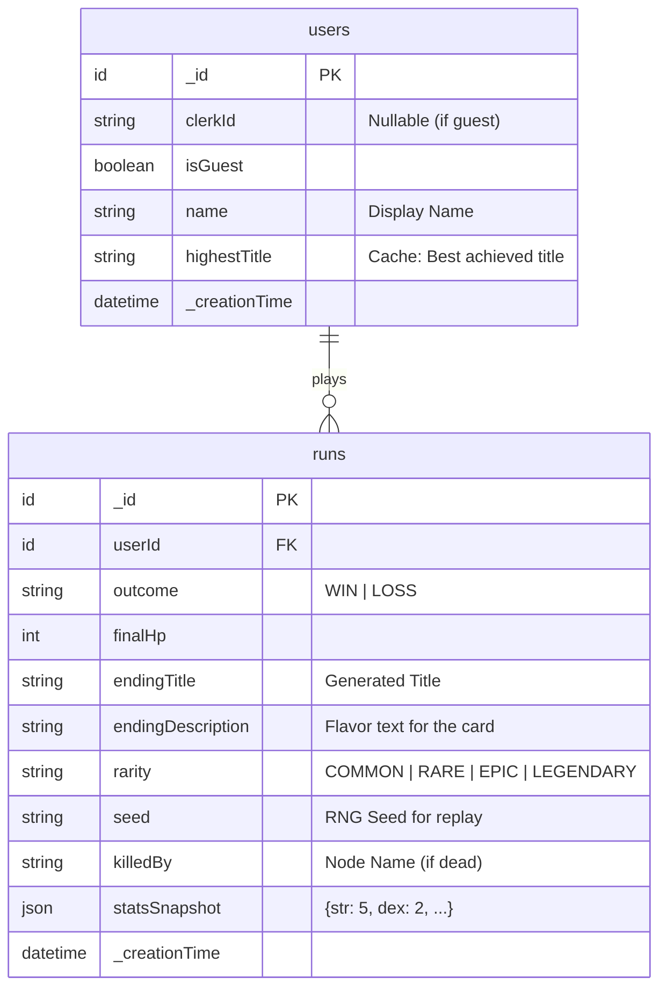

# Core ERD: One-Minute Dungeon

> **Status:** Approved for MVP
> **Database:** Convex (Document Store)

## 1. Entity Relationship Diagram (Mermaid)

## 2. Entity Catalog

### 2.1. Users (`users`)
Represents a player identity. Starts as a Guest (no `clerkId`) and can be "claimed" (added `clerkId`).

| Field | Type | Required | Description |
| :--- | :--- | :--- | :--- |
| `_id` | `Id<'users'>` | Yes | System ID. |
| `clerkId` | `string` | No | External Auth ID. Null for Guests. |
| `isGuest` | `boolean` | Yes | `true` if soft-auth account. |
| `name` | `string` | Yes | Defaults to "Anonymous Adventurer". |
| `highestTitle` | `string` | No | Cached string of their best run (e.g., "The Dragon Slayer"). |
| `tokens` | `number` | Yes | Currency (Gold) for future monetization. Default 0. |

### 2.2. Runs (`runs`)
An immutable record of a completed game session.

| Field | Type | Required | Description |
| :--- | :--- | :--- | :--- |
| `_id` | `Id<'runs'>` | Yes | System ID. |
| `userId` | `Id<'users'>` | Yes | Link to player. |
| `outcome` | `string` | Yes | Enum: `WIN` or `LOSS`. |
| `finalHp` | `number` | Yes | HP remaining at end (0 if dead). |
| `endingTitle` | `string` | Yes | The title awarded (e.g., "The Clumsy Bard"). |
| `endingDescription` | `string` | Yes | Flavor text (e.g., "Tripped on a rock."). |
| `rarity` | `string` | Yes | Enum: `COMMON`, `RARE`, `EPIC`, `LEGENDARY`. |
| `seed` | `string` | Yes | The random seed used for the dungeon (for verification). |
| `statsSnapshot` | `object` | Yes | JSON of final stats: `{ str, dex, int, cha }`. |
| `killedBy` | `string` | No | Name of the node that killed them (if Outcome = LOSS). |

## 3. Data Access Patterns

### 3.1. User Profile Load
*   **Query:** `useQuery(api.users.getMe)`
*   **Logic:** Returns current user metadata + aggregation of their runs (count, best title).

### 3.2. Run History
*   **Query:** `useQuery(api.runs.getByUser, { userId })`
*   **Index:** `by_user_id` on `runs` table (Automatic in Convex depending on query).
*   **Ordering:** Descending by `_creationTime`.

### 3.3. Leaderboard (Future)
*   **Query:** `useQuery(api.runs.getBestRuns)`
*   **Filter:** `rarity == 'LEGENDARY'`
*   **Index:** Need compound index on `rarity` + `_creationTime`.

## 4. Security Rules (RLS equivalent)
*   **Users:** Can only read/update their own profile.
*   **Runs:**
    *   `create`: Server-side mutation only (triggered by game engine).
    *   `read`: Public (for sharing cards) or User-only? *Decision: Public (anyone with ID can view a run result for sharing).*
