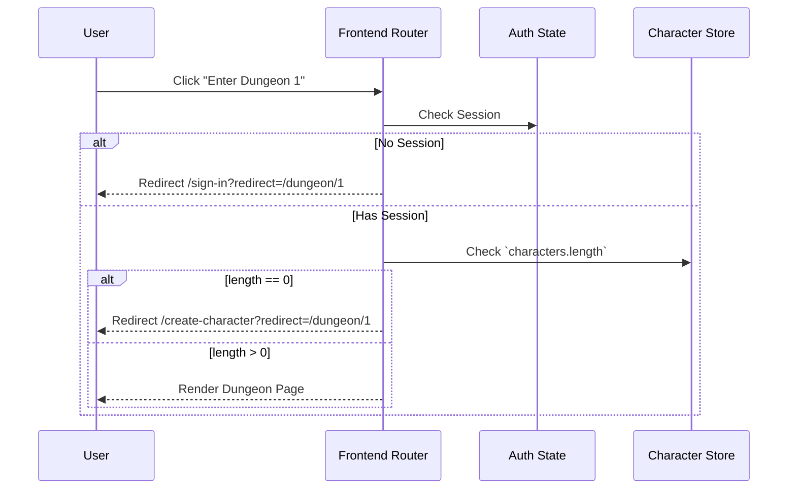

# Technical Design Document (TDD)
**Feature**: Character Creation Before Entering Dungeon

## 1. Overview
This document outlines the technical implementation details for intercepting dungeon entry routes. Unauthenticated users will be redirected to the Sign-In Clerk, and authenticated users without characters will be redirected to Character Creation, preserving their intended destination.

## 2. Architecture & Components

**Frontend Framework (Assumption: Next.js / Nuxt / React Router)**
The intercept logic should be implemented at the routing layer or via a layout/wrapper component that encapsulates the `/dungeon/[id]` route.

### 2.1 Routing Interceptor (Middleware / Higher Order Component)
A mechanism is needed to run checks *before* the dungeon page renders.

**Logic Flow:**
1. User requests `/dungeon/[id]`.
2. Interceptor checks `useAuthSession()`.
   - If `null` -> trigger redirect to `/sign-in?redirect=/dungeon/[id]`.
3. Interceptor checks `useUserCharacters()`.
   - If `characters.length === 0` -> trigger redirect to `/create-character?redirect=/dungeon/[id]`.
4. If both checks pass, allow the route to render normally.

### 2.2 Preserving Destination State
The `redirect` query parameter is the most robust way to handle state across full-page reloads (common in OAuth sign-in flows). 

- **Sign-In page update:** The Sign-In component must be updated to read the `?redirect=` query param. Upon successful login, instead of defaulting to the home page, it must push the user to the provided redirect URL.
- **Character Creation page update:** Similarly, upon successful creation, the form submission handler must check for a `?redirect=` param and navigate there instead of a default dashboard.

## 3. Data Flow

### Sequence Diagram

## 4. Alternative Approaches
*Alternative 1: Server-side Middleware.*
If using a meta-framework like Next.js, this check could happen in `middleware.ts`. 
*Pros:* Prevents sending any client-side JavaScript for the dungeon if unauthorized.
*Cons:* Middleware often cannot easily read complex character data state without an external API call, which adds latency. Edge middleware usually only has scope for simple auth cookies. Therefore, client-side route guarding or server-side rendering checks on the specific page are preferred.

## 5. Security & Edge Cases
- **Open Redirect Vulnerabilities:** Ensure that the `redirect` parameter is validated to point only to relative paths (e.g., must start with `/` and not `http://`) to prevent malicious phishing links.
- **Race conditions:** Ensure the route guard waits for the auth state and character state to finish loading (`isLoading === false`) before making a redirect decision. If it evaluates while still fetching, it might prematurely redirect users.

## 6. Testing Strategy
- **Unit Tests:** Test the route guard function with mocked auth (`null`) and mocked character arrays (`[]`, `[{...}]`).
- **E2E Tests:** Use Cypress or Playwright to click a dungeon link while logged out, log in, create a character, and assert the final URL is the dungeon URL.
